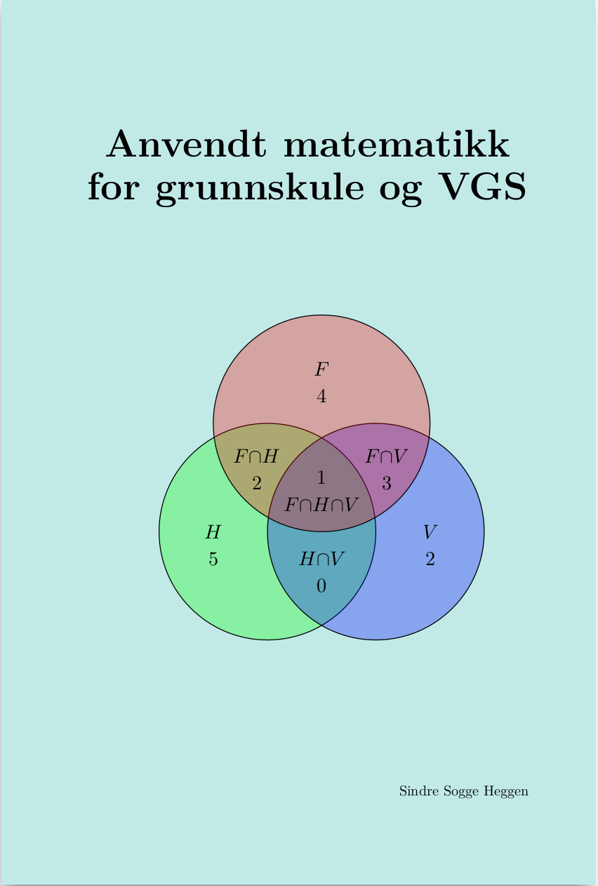

 

# Om boka

_Anvendt matematikk_ er en gratis lærebok (i PDF-format) beregnet for grunnskole (5.-10.klasse) og VGS (1P og 2P). Boka presenterer anvendelser av matematikken som er omtalt i boka [Matematikkens byggesteiner](https://sindrsh.github.io/FirstPrinciplesOfMath/).

Blant temaene som dekkes er
- Reknestrategier for de fire rekneartene
- Størrelser og enheter
- Areal, omkrets og volum
- Prosentrekning
- Forhold og målestokk
- Økonomi
- Sannsynlighet
- Statistikk
- Excel og GeoGebra
- Programmering

### Filer

- [Anvendt matematikk for grunnskole og VGS](https://github.com/sindrsh/AppliedMath/blob/master/AM.pdf)
 
Den komplette filstrukturen for læreverket er tilgjengelig på GitHub (trykk på _View on GitHub_ øverst på denne siden)

Se også 
- [Matematikkens byggesteiner](https://sindrsh.github.io/FirstPrinciplesOfMath/) (en grunnleggende innføring i matematikk)
- [Før Kalkulus](https://sindrsh.github.io/precalc/) (et gratis læreverk for matematikk R2)

### Kontakt
sindre.heggen@gmail.com

